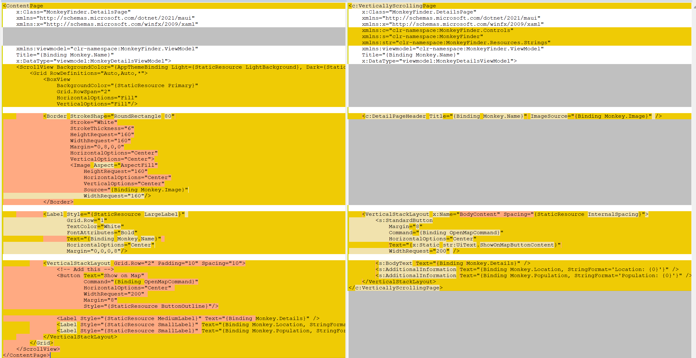

# Part 0 - Overview

In this workshop, we will focus on creating UIs with XAML. If you're not a fan of XAML and prefer to make the UI with C#, that's a valid option, and you're welcome to do so, but we won't be covering that here.  However, you might want to stick around (or skip to the end) and see if the XAML we end up with is more to your liking.

Let's start by looking at an example [page from the final version](https://github.com/mrlacey/dotnet-maui-workshop-xaml/blob/main/Part%205%20-%20Custom%20Types/Finish/MonkeyFinder/View/DetailsPage.xaml).  
Now, compare it with [the version we started with](https://github.com/mrlacey/dotnet-maui-workshop-xaml/blob/main/Part%201%20-%20Fundamentals/Start/MonkeyFinder/View/DetailsPage.xaml).

It looks very different:

- It's much shorter: 27 lines rather than 56
- It contains fewer elements: 7 rather than 12
- Those elements include fewer attributes: 21 rather than 48

Those changes are what's easily quantifiable, but there are some intangible differences too:

- **It's now quicker to read**. And not just because there's less text on the screen.
- **It's easier to understand**. Because you don't have to determine what the elements represent or why they're there.
- **It's easier to support and modify (maintain)**. By understanding what's there and why, there's less chance of unexpected consequences when making a change.

There are many ways to improve the **Monkey Finder** app you created as part of the .NET MAUI Workshop, but in this workshop, we'll only look at the XAML.  
This focus is because many people frequently overlook XAML, but it's one of the most criticized aspects of building apps with .NET MAUI.

## 0.1 - Why it's important to look in detail at how we write XAML

XAML is often criticized as being overly complex and verbose. This is often due to the way it's written, but this doesn't have to be the case. If there are two different ways of writing something, one that takes six lines and another that only requires a single line, and you choose to use the longer version, complaining about the need for extra lines is, at best, misplaced. However, some people never learn that the shorter option is available. That's what this workshop is here to show you.

Many people are unaware that there are multiple ways of writing XAML, and I've met very few developers who have ever thought about what "good XAML" looks like.

If you haven't considered this before, take a moment now to consider what makes a good XAML file.

It's ok, I'll wait.

...

...

...

...

What did you come up with?

Here's my list.

Good XAML should be:

- **Clear** - so it's easy to read and understand.
- **Concise** - so there's no unnecessary duplication or unnecessary text.
- **Consistent** - which makes it easier to read and understand.
- **Self-describing** - so it doesn't need extra comments or time spent deciphering the complex nested XML.
- **Maintainable** - which results from all of the above.

Hopefully, you can appreciate that none of my points about what makes good XAML are specific to XAML but apply to _any_ programming language.

These points will help you write good code in any programming language. And yes, I do consider XAML to be a programming language. No, it's not Turing-complete, and it's not capable of many things that other programming languages are. Still, it's text files that we pass to the compiler and ultimately end up helping to create our application. When we think of XAML files this way, it's clear that we should be treating them with more care and attention.

If you're new to working with XAML and aren't familiar with some of the problems I've already hinted at, I'll show bad examples in the coming parts so you can see the types of issues you can avoid.

## 0.2 - Why is this workshop necessary?

If you're one of the people who has never before considered what counts as "good XAML," then it should be obvious why this is important.

From a broader perspective, I think there are three factors that have led to the widespread use of low-quality XAML today.

1. Developers treat XAML as the designer's responsibility - and designers don't care about XAML.
2. XAML was originally intended to be written by tools and not by hand.
3. There are very few examples of what "good" can look like or effort to improve things.

### 0.2.1 - Whose responsibility is XAML?

I'm sure you're an exception to these generalizations, but many (most?) developers don't spend much time and effort focusing on the UI of their applications. The design and styling of the UI often falls to other people (designers), and they are not the ones who implement the designs. This disconnect means that no one person takes full ownership of the code used to implement the UI, and as long as the running app matches the images created by the designer, everyone can move on to other things (that they'd rather be doing.)

Break the habit and take responsibility for what your XAML files look like. You'll benefit in the future when you come to modify them.

### 0.2.2 - Write for humans

In 2006, when XAML was first released (as part of WPF), the intention and expectation was that developers would use specific design-related tools to create their UIs with XAML and not write it all by hand. Over time, we've lost many of these design tools, and now there is little option (especially for .NET MAUI) other than to write XAML by hand. Elements defined with multiple levels of nesting and over many lines aren't a problem if you only see the UI through a design tool, but if you have to write that by hand (even in an editor with intellisense) it's far from ideal.

You are not a robot. Your XAML will need to be read by other humans. Therefore, it makes sense to optimize writing XAML so that it's easier and simpler for people to write and read. The tooling doesn't have a preference for how the code is formatted, so you can use what's easiest (and best) for you and your team.

### 0.2.3 - We can make things better, together

"It's only XAML. It doesn't matter." Until it does.  
When you have to explain why what should be a simple change to the UI is taking ages because it's hard to alter one thing without unintended side effects. Or when you dread having to work with a particular code base because it's so hard to work out what the existing code does.

These are scenarios that have been shared with me many times. But it's not our fault:

- Over the years, very little time has been spent teaching more than the fundamentals of writing XAML.
- There is a lack of samples and examples we can look at to see XAML being done well.
- There are only a handful of people who have built tools to make working with XAML easier.
- And, the effort to change or evolve the language has been minimal.

While these are why we're in this situation, they don't excuse it.

We still need to create applications we can easily modify and maintain. It should not be expected that UIs are hard to change without much effort, testing, and unintended consequences.

There is a better way. And we need it.

## 0.3 - What we'll be looking at

Through the following parts of this workshop, we'll look at principles, "best practices," and techniques for writing good code (of any kind/language) and applying them to our XAML.

- In part 1, we'll look at the fundamentals of setting up our code base.
- In part 2, we'll look at applying the Single Responsibility Principle to our XAML.
- In part 3, we'll see how "magic values" often permeate XAML files in ways that would not be tolerated in any other language.
- In part 4, we'll explore how naming elements in XAML is especially important and how most people and samples get this wrong.
- And part 5, we'll see how custom types (of varying levels of complexity) can make a big difference.

## 0.4 - Disclaimer

Many of the techniques, principles, and ideas covered in this workshop only have noticeable benefits when working on larger projects and applications. For a simple app like the **Monkey Finder** there is a perfectly valid argument that the XAML you already have is adequate for such an application.

However, you are likely to want to build other applications that are larger and have more pages, views, and other functionality. Many of the problems people run into with building and maintaining larger code bases are that they try to write them like they do trivial apps and then wonder why they encounter issues. You wouldn't write a large, complex amount of C# in the same way you wrote your first Console app to display "Hello World".

The aim of this workshop isn't to show how to change the XAML of the **Monkey Finder** app; _it's to show you principles you can apply to other, more complex apps_.

My intention is not that you build apps with XAML in the ways shown in the original workshop (and elsewhere) and then modify that XAML to be easier to work with. Instead, it is that you get to a point where you can start with the better version. However, jumping straight into a different way of doing things can make it hard to understand why the reasons for the changes. Instead, we'll work through the list of principles to see how to apply them to existing XAML code. You'll then understand how to use them in the code you write in the future.

## 0.5 - Getting started

Now that you know why it's important to think about XAML like any other programming language

Now that you're ready to focus on XAML let's look at some code! [Head over to Part 1 to get started](../Part%201%20-%20Fundamentals/README.md)!
