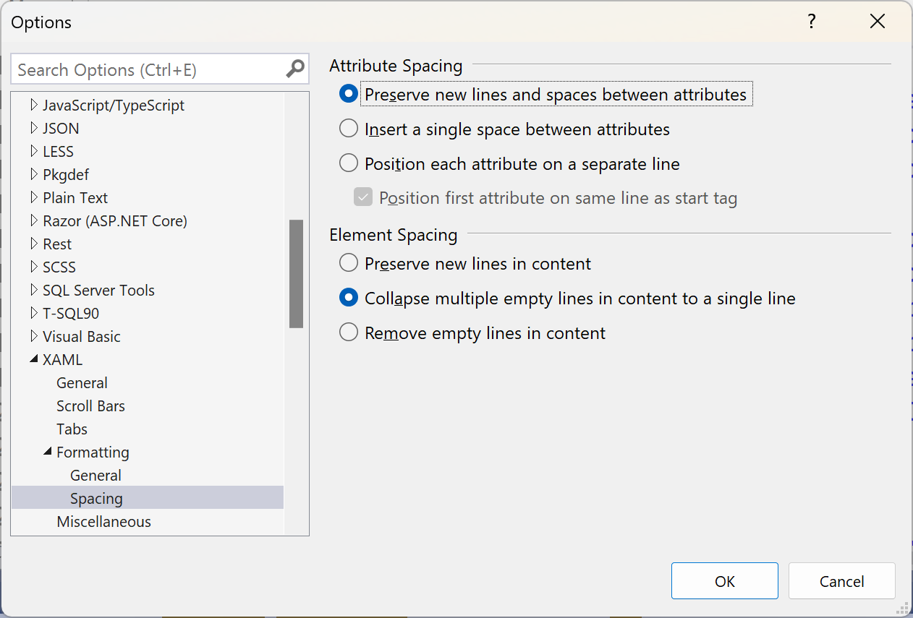
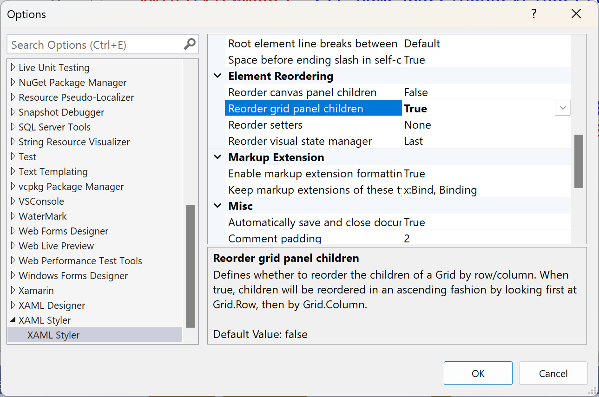
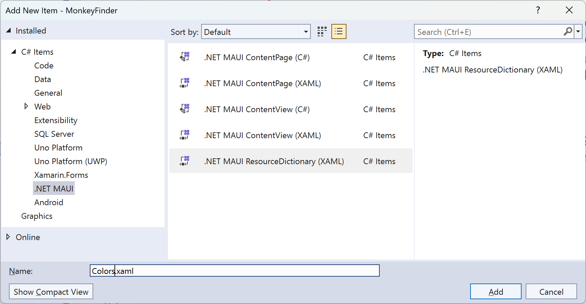
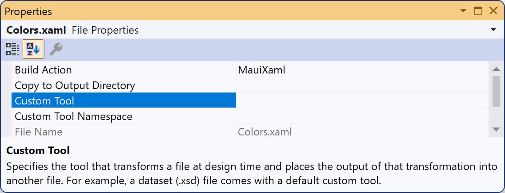

# Part 1 - Fundamentals

In this part, we will look at the fundamentals of a good code base regardless of programming language and apply them to XAML. We won't cover the fundamentals of XAML as a language, as many other resources cover this topic.

While the last part was entirely theoretical, we're now ready to look at code. As we're carrying on from the other workshop, you can keep going with the code you had there. Alternatively, open the [solution in the Finish directory of the original workshop](../../../Finish/).

## 1.0 - Outline

In this part, we will start with some simple tasks because getting the fundamentals right is essential for performing more advanced tasks.

These may be things you already do. If that's the case, congratulations. Even if you do these things already, it's still good to stop and appreciate the importance of getting the fundamentals right, as this will set you up for doing more complex tasks in future parts.

In this part, we'll look at:

- Ensuring our XAML code is consistent.
- Removing unnecessary comments.
- How to structure the contents of individual files.
- How to structure individual files within the project.

These are simple tasks, but don't be fooled into thinking everything will be this simple. Once we pass the fundamental stage, there will be much more to see.

## 1.1 - Consistency

A tidy code base is a happy code base. More importantly, a consistent code base is easier to maintain.

As developers, we spend much more time reading (and trying to understand) code than writing it. Assuming it works and momentarily ignoring other constraints, writing easy-to-maintain code is the most valuable thing you can do as a developer. This is because easy-to-maintain code can be changed quickly and without unexpected side effects.

If the code is messy, how do you find what you want?  
You'll spend longer trying to understand the code if you first have to work out why it is the way it is and if the seemingly unnecessary variations and inconsistencies are there for a reason.

Inconsistencies are distracting and not only make code harder to read but also make it harder to review. Very few people like spending time on code reviews. You'll make life easier for anyone (including yourself) who has to review the code by making it easier to read. No one wants to spend their time deciphering why you've changed indents, switched the order of parameters, or changed the number of blank lines. They want to focus on how a bug was fixed or if a feature has been added in a suitable way. When a consistently formatted code base is modified, the changes are clear to see, and no one is unnecessarily distracted by things that aren't important.

So, having convinced you of the importance of having a consistently formatted code base, let's look at how to ensure we maintain this.

Visual Studio has very limited built-in capabilities for formatting XAML files, so we will look to a free extension to provide a better experience.

The tool we're going to install is called XAML Styler. It is an open-source project ([with a home on GitHub](https://github.com/Xavalon/XamlStyler)) that provides the ability to format XAML based on a set of rules. (Note that even though "Style" is in the name, this is a formatting tool and has nothing to do with `Styles` used in XAML files. -- Great tool, potentially misleading name.)

There are versions of XAML Styler available for [multiple platforms](https://github.com/Xavalon/XamlStyler/wiki), but we're going to use the [Visual Studio extension](https://marketplace.visualstudio.com/items?itemName=TeamXavalon.XAMLStyler2022).

There are two ways to install the extension.

1. From the marketplace

- Go to [the entry in the Visual Studio Marketplace](https://marketplace.visualstudio.com/items?itemName=TeamXavalon.XAMLStyler2022)
- Click 'Download'
- Make sure Visual Studio is closed
- Run the VSIX installer

or

2. Inside Visual Studio

- Select Extensions > Manage Extensions
- Search for "XAML Styler"
- Click the Download button next to the entry for "XAML Styler for Visual Studio 2022"
- Close Visual Studio
- Follow the steps in the VSIX installer

Once XAML Styler is installed, reopen the solution in Visual Studio.

Now open each XAML file in turn, right-click on the editor window, and select **Format XAML**.

- App.xaml
- AppShell.xaml
- View/DetailsPage.xaml
- View/MainPage.xaml

Now, all the XAML files have the following:

- Consistent levels of indentation.
- Consistent ordering of attributes.
- Consistent behavior regarding starting attributes on new lines (or not).

> **Note**  
> There are lots of configurable settings to enable you to format files the way you prefer. You are encouraged to explore the available options and set them to your preference after completing the workshop.

You may have noticed that some files still contain multiple consecutive blank lines.  
We can remove these too. You can do it manually or via a setting in Visual Studio:

- Open the **Tools > Options** menu
- Select **Text Editor > XAML > Formatting > Spacing**
- Under **Element Spacing** select **Collapse multiple empty lines in content to a single line**



To apply the Visual Studio formatting of multiple lines, select **Edit > Advanced > Format Document**.

> **Tip**:  
> If you're modifying a code base with no existing formatting standards, do not make changes to the formatting at the same time as making other changes to the document. Change the formatting and then commit the changes to your source control repository. Then, make any other changes as a separate commit. This makes it easy to see what has changed without having to mentally separate it from the formatting changes.

Sometimes, you may need to compromise readability for performance or other priorities. If that's the case, then you should do so. In such cases, it can be helpful to add comments. Nothing in the Monkey Finder app means we need to put anything above maintainability and readability. So, there's no need for us to have any comments in the code.

However, you may have noticed some comments in the code. Let's get rid of them.

## 1.2 - Comments

Good code is self-describing and doesn't need comments to explain _what_ it does. At best, comments like this are redundant and add clutter. What's worse is when such comments aren't updated when the code is changed. This leads to code that does one thing, but its accompanying comment says something different. Scenarios like this can be confusing as it's not always apparent which is correct. Time and effort are then wasted working out if the comment is outdated or if the code needs to be changed to match the comment.

Comments are useful when they describe _why_ a piece of code is as it is.  
Did you break a standard or convention? If so, explain why.  
Is a piece of code complex? Add a description to help the next person to read it to understand it.
Is there information not included elsewhere in the code that is useful (or necessary) for people reading the code to know? It needs documenting somewhere, and next to the code it relates to is often the best location.

Our current code base doesn't have any helpful comments, but we do have some we can remove.

In `DetailsPage.xaml` and `MainPage.xaml`, you'll find the following comment:

```xml
<!-- Add this -->
```

This is obviously left over from the steps in the previous workshop and is no longer needed.

In `MainPage.xaml`, you'll also find an example of how to customize the `ItemsLayout` for a `CollectionView`.

```xml
    <!--<CollectionView.ItemsLayout>
        <GridItemsLayout  Orientation="Horizontal" Span="3"/>
    </CollectionView.ItemsLayout>-->
```

Again, this isn't needed and so can be removed.

Keeping commented-out code in a file is another way of confusing someone looking at the code in the future.  
Is it meant to be commented out? If so, why has it been left in? Was this deliberate or done while the developer was working on something else?

If the code is definitely not needed, remove it.  
If commented out because it's likely to be needed in the future, an appropriate explanation should accompany it.  
Even better than leaving it in the file for future use is moving it to the issue or bug tracking system with details of whatever it is that will need this. Whoever works on the thing that needs this then has access to it when they need it without cluttering the file for everyone else.

We need to consider more than what should (and shouldn't) be in a file. We also need to consider the order of elements within a XAML file.

## 1.3 - The structure within files

A XAML file describes the elements that make up a UI. Having the order of the elements in the file reflect the order they are in on screen makes it easier to understand. For some controls, such as a `StackLayout`, the order of child elements in the file directly relates to the order they are shown on screen. For other controls the orders don't have to be the same.

With a `Grid`, the child elements use **attached properties** to define which column(s) and row(s) they occupy and these don't have to correspond to the order they appear in the file.  
However, it's much easier to understand code when the physical order of child elements in the file also reflects their logical order in the UI.

Let's look at `MainPage.xaml`, and we see that it uses a `Grid` containing two rows and two columns.

In the first row is the `CollectionView` (inside a `RefreshView`) showing the monkeys.  
In the second row, the "Get Monkeys" `Button` is on the left, and the "Find Closest" `Button` is on the right.  
Finally, there is an `ActivityIndicator` that occupies both rows and columns.

Reading the file, it would be easy to miss that the `ActivityIndicator` is placed in the first row and first column because it is the last element listed in the file.  
Similarly, it could easily cause confusion if the `Button` that is displayed on the right was listed first.

Fortunately, there is a simple solution to this. XAML Styler includes an option to sort the children of a `Grid` in an order that reflects how they will be displayed.

Enable this by selecting **Tools > Options > XAML Styler**. Then, under **Element Reordering**, set **Reorder grid panel children** to **True**.



After setting this option and applying the formatting change, the `ActivityIndicator` will be above the `Button`s in the file.

> **Important**  
> If more than one person is working with a code base it's important that everyone is using the same settings. XAML Style supports this through the use of an [external configuration file](https://github.com/Xavalon/XamlStyler/wiki/External-Configurations). An example file using the settings defined above is included in the root of this repository.

Having thought about the structure of individual files, let's expand our thinking to the structuring of files within the project.

## 1.4 - The structure of the project

The Monkey Finder app is small and simple, but more complex apps can quickly need many more `Resources`. When this is the case, defining all the `Resources` in `App.xaml` becomes hard to manage.

We'll move the `Resources` into separate `ResourceDictionaries`.

In **Solution Explorer**, right-click on the **Resources** folder and select **Add > New Folder**.  
Give it the name **Styles**.

Now right-click on the **Styles** folder and select **Add > New Item...**.  
Select **.NET MAUI** from the list on the left, then select **.NET MAUI ResourceDictionary (XAML)**.  
Name the file `Colors.xaml`.



When the file has been created, right-click on it, select **Properties**, and in the properties window, delete the value specified for the **Custom Tool**.



If a file `Colors.xaml.cs` has been created, delete it.

Repeat the above to create a ResourceDictionary called `Styles.xaml`

Visual Studio may have added some entries to the project file that aren't necessary. Open `MonkeyFinder.csproj` and, if present, remove the following.

```xml
<!-- Remove this ItemGroup (if present) -->
<ItemGroup>
    <MauiXaml Update="Resources\Styles\Colors.xaml">
    <Generator></Generator>
    </MauiXaml>
    <MauiXaml Update="Resources\Styles\Styles.xaml">
    <Generator></Generator>
    </MauiXaml>
</ItemGroup>
```

Cut and paste the `Color`s from `App.xaml` into `Colors.xaml`.

`Colors.xaml` should now look like this:

```xml
<?xml version="1.0" encoding="utf-8" ?>
<ResourceDictionary
    xmlns="http://schemas.microsoft.com/dotnet/2021/maui"
    xmlns:x="http://schemas.microsoft.com/winfx/2009/xaml">

    <Color x:Key="Primary">#FFC107</Color>
    <Color x:Key="PrimaryDark">#FFA000</Color>
    <Color x:Key="Accent">#00BCD4</Color>

    <Color x:Key="LightBackground">#FAF9F8</Color>
    <Color x:Key="DarkBackground">Black</Color>

    <Color x:Key="CardBackground">White</Color>
    <Color x:Key="CardBackgroundDark">#1C1C1E</Color>

    <Color x:Key="LabelText">#1F1F1F</Color>
    <Color x:Key="LabelTextDark">White</Color>
</ResourceDictionary>
```

Now cut and paste the remaining `Resources` from `App.xaml` into `Styles.xaml`.

`Styles.xaml` should now look like:

```xml
<?xml version="1.0" encoding="utf-8" ?>
<ResourceDictionary
    xmlns="http://schemas.microsoft.com/dotnet/2021/maui"
    xmlns:x="http://schemas.microsoft.com/winfx/2009/xaml">

    <Style ApplyToDerivedTypes="True" TargetType="Page">
        <Setter Property="BackgroundColor" Value="{AppThemeBinding Light={StaticResource LightBackground}, Dark={StaticResource DarkBackground}}" />
    </Style>

    <Style ApplyToDerivedTypes="True" TargetType="NavigationPage">
        <Setter Property="BackgroundColor" Value="{AppThemeBinding Light={StaticResource LightBackground}, Dark={StaticResource DarkBackground}}" />
        <Setter Property="BarBackgroundColor" Value="{StaticResource Primary}" />
        <Setter Property="BarTextColor" Value="White" />
    </Style>

    <Style x:Key="BaseLabel" TargetType="Label">
        <Setter Property="FontFamily" Value="OpenSansRegular" />
        <Setter Property="TextColor" Value="{AppThemeBinding Light={StaticResource LabelText}, Dark={StaticResource LabelTextDark}}" />
    </Style>

    <Style
        x:Key="MicroLabel"
        BasedOn="{StaticResource BaseLabel}"
        TargetType="Label">
        <Setter Property="FontSize" Value="10" />
    </Style>

    <Style
        x:Key="SmallLabel"
        BasedOn="{StaticResource BaseLabel}"
        TargetType="Label">
        <Setter Property="FontSize" Value="12" />
    </Style>

    <Style
        x:Key="MediumLabel"
        BasedOn="{StaticResource BaseLabel}"
        TargetType="Label">
        <Setter Property="FontSize" Value="16" />
    </Style>

    <Style
        x:Key="LargeLabel"
        BasedOn="{StaticResource BaseLabel}"
        TargetType="Label">
        <Setter Property="FontSize" Value="20" />
    </Style>

    <Style ApplyToDerivedTypes="True" TargetType="RefreshView">
        <Setter Property="RefreshColor" Value="{StaticResource Primary}" />
        <Setter Property="Background" Value="{AppThemeBinding Light={StaticResource LightBackground}, Dark={StaticResource DarkBackground}}" />
    </Style>

    <Style x:Key="ButtonOutline" TargetType="Button">
        <Setter Property="Background" Value="{AppThemeBinding Light={StaticResource LightBackground}, Dark={StaticResource DarkBackground}}" />
        <Setter Property="TextColor" Value="{StaticResource Primary}" />
        <Setter Property="BorderColor" Value="{StaticResource Primary}" />
        <Setter Property="BorderWidth" Value="2" />
        <Setter Property="HeightRequest" Value="40" />
        <Setter Property="CornerRadius" Value="20" />
    </Style>
    <Style x:Key="CardView" TargetType="Frame">
        <Setter Property="BorderColor" Value="#DDDDDD" />
        <Setter Property="HasShadow" Value="{OnPlatform iOS=false, MacCatalyst=false, Default=true}" />
        <Setter Property="Padding" Value="0" />
        <Setter Property="Background" Value="{AppThemeBinding Light={StaticResource CardBackground}, Dark={StaticResource CardBackgroundDark}}" />
        <Setter Property="CornerRadius" Value="10" />
        <Setter Property="IsClippedToBounds" Value="True" />
    </Style>
</ResourceDictionary>
```

We now need to let `App.xaml` know the location of the `Resources` we've just moved. Do this by merging the `ResourceDictionary` in each of the new files into the dictionary of `Application.Resources`.

Update `App.xaml` so that it looks like this:

```xml
<?xml version="1.0" encoding="utf-8" ?>
<Application
    x:Class="MonkeyFinder.App"
    xmlns="http://schemas.microsoft.com/dotnet/2021/maui"
    xmlns:x="http://schemas.microsoft.com/winfx/2009/xaml"
    xmlns:local="clr-namespace:MonkeyFinder">
    <Application.Resources>
        <ResourceDictionary>
            <ResourceDictionary.MergedDictionaries>
                <ResourceDictionary Source="Resources/Styles/Colors.xaml" />
                <ResourceDictionary Source="Resources/Styles/Styles.xaml" />
            </ResourceDictionary.MergedDictionaries>
        </ResourceDictionary>
    </Application.Resources>
</Application>
```

`App.xaml` is now responsible for bringing all the different `Resources` together rather than defining them. As a general rule, it's easier to work with multiple, smaller files that are each focused on one thing than it is to work with one large file that tries to do everything.

You may recognize the files we've added as being the same as those included by default in a new .NET MAUI project. This isn't a coincidence. Grouping resources like this has been popular since before .NET MAUI was released. It isn't a requirement or a rule that you use these files and only these files. Create files that group related Resources together and give the files appropriate names. Just make sure you're consistent. (Consistency is so important; we'll look at it more in Part 4.)

If you run the app now, it will still look and behave exactly the same way as at the start of this part. All we've done is change the structure and formatting of some files. There haven't been any big changes yet, as we've only focused on the fundamentals. We need to ensure these are right before making more profound changes, like the ones in the following parts.

[Now, head over to Part 2 and start thinking about responsibility](../Part%202%20-%20Responsibility/README.md)!
