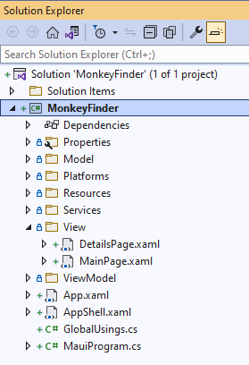
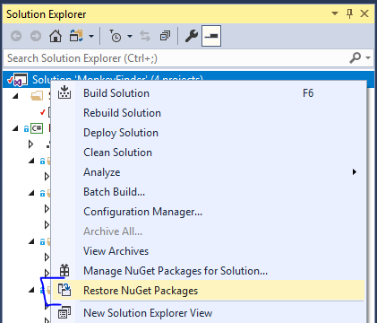
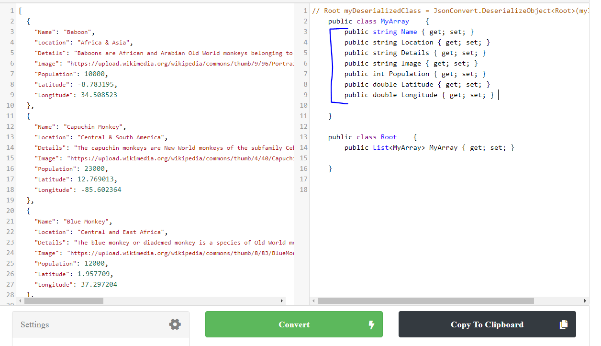
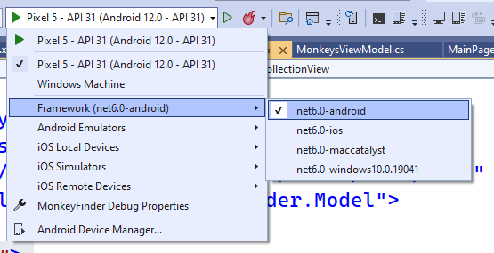
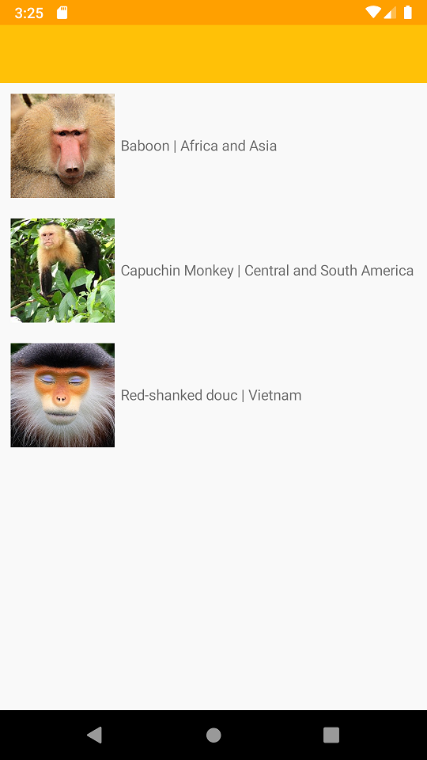

## Displaying Data

In Part 0 you got a basic understanding of what makes up a .NET MAUI project, now let's start coding and see how to display a list of data in a list.

This module is also available in [Chinese (Simplified)](README.zh-cn.md) & [Chinese (Traditional)](README.zh-tw.md).

### Open Solution in Visual Studio

1. Open **Part 1 - Displaying Data/MonkeyFinder.sln**

This MonkeyFinder contains 1 project:

* MonkeyFinder - The main .NET MAUI project that targets Android, iOS, macOS, and Windows. It includes all scaffolding for the app including Models, Views, ViewModels, and Services.



The **MonkeyFinder** project also has blank code files and XAML pages that we will use during the workshop. All of the code that we modify will be in this project for the workshop.

### NuGet Restore

All projects have the required NuGet packages already installed, so there will be no need to install additional packages during the Hands on Lab. The first thing that we must do is restore all of the NuGet packages from the internet.

1. **Right-click** on the **Solution** and select **Restore NuGet packages...**




### Model

We will be downloading details about the monkey and will need a class to represent it.



We can easily convert our json file located at [montemagno.com/monkeys.json](https://montemagno.com/monkeys.json) by using [json2csharp.com](https://json2csharp.com) and pasting the raw json into quicktype to generate our C# classes. Ensure that you set the Name to `Monkey` and the generated namespace to `MonkeyFinder.Model` and select C#. 

1. Open `Model/Monkey.cs`
2. In `Monkey.cs`, copy/paste the properties:

```csharp
public class Monkey
{        
    public string Name { get; set; } 
    public string Location { get; set; } 
    public string Details { get; set; } 
    public string Image { get; set; } 
    public int Population { get; set; } 
    public double Latitude { get; set; } 
    public double Longitude { get; set; } 
}
```

### Displaying Data

We can display hard coded data of any data type in a `CollectionView` in our `MainPage.xaml`. This will allow us to build out our user interface by setting the `ItemTemplate` with some simple images and labels. 

We first need to add a new namespace at the top of the `MainPage.xaml`:

```xml
xmlns:model="clr-namespace:MonkeyFinder.Model"
```

This will allow us to reference the Monkey class above for data binding purposes.

Add the following into the MainPage.xaml's `ContentPage`:

```xml
<CollectionView>
    <CollectionView.ItemsSource>
        <x:Array Type="{x:Type model:Monkey}">
            <model:Monkey
                Name="Baboon"
                Image="https://raw.githubusercontent.com/jamesmontemagno/app-monkeys/master/baboon.jpg"
                Location="Africa and Asia" />
            <model:Monkey
                Name="Capuchin Monkey"
                Image="https://raw.githubusercontent.com/jamesmontemagno/app-monkeys/master/capuchin.jpg"
                Location="Central and South America" />
            <model:Monkey
                Name="Red-shanked douc"
                Image="https://raw.githubusercontent.com/jamesmontemagno/app-monkeys/master/douc.jpg"
                Location="Vietnam" />
        </x:Array>
    </CollectionView.ItemsSource>
    <CollectionView.ItemTemplate>
        <DataTemplate x:DataType="model:Monkey">
            <HorizontalStackLayout Padding="10">
                <Image
                    Aspect="AspectFill"
                    HeightRequest="100"
                    Source="{Binding Image}"
                    WidthRequest="100" />
                <Label VerticalOptions="Center" TextColor="Gray">
                    <Label.Text>
                        <MultiBinding StringFormat="{}{0} | {1}">
                            <Binding Path="Name" />
                            <Binding Path="Location" />
                        </MultiBinding>
                    </Label.Text>
                </Label>
            </HorizontalStackLayout>
        </DataTemplate>
    </CollectionView.ItemTemplate>
</CollectionView>
```


If we wanted to display the  two strings vertically on top of each other, we could wrap two `Label` controls inside of a `VerticalStackLayout` and assign font sizes to stand out:


```xml
 <HorizontalStackLayout Padding="10">
    <Image
        Aspect="AspectFill"
        HeightRequest="100"
        Source="{Binding Image}"
        WidthRequest="100" />
    <VerticalStackLayout VerticalOptions="Center">
        <Label Text="{Binding Name}" FontSize="24" TextColor="Gray"/>
        <Label Text="{Binding Location}" FontSize="18" TextColor="Gray"/>
    </VerticalStackLayout>
</HorizontalStackLayout>
```


### Run the App

Ensure that you have your machine setup to deploy and debug to the different platforms:

* [Android Emulator Setup](https://docs.microsoft.com/dotnet/maui/android/emulator/device-manager)
* [Windows setup for development](https://docs.microsoft.com/dotnet/maui/windows/setup)

1. In Visual Studio, set the Android or Windows app as the startup project by selecting the drop down in the debug menu and changing the `Framework`




2. In Visual Studio, click the "Debug" button or Tools -> Start Debugging
    - If you are having any trouble, see the Setup guides for your runtime platform

Running the app will result in a list of three monkeys:



Let's continue and learn about using the MVVM pattern with data binding in [Part 2](../Part%202%20-%20MVVM/README.md)
