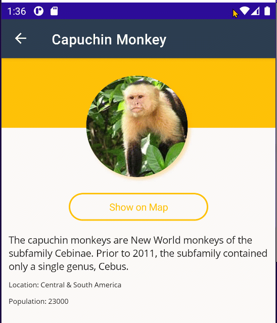

## App Themes

Up to this point, we have used a standard light theme on the application. .NET MAUI has the concept of reusable Application Resources and resources that can automatically adapt to the theme of the device. 

This module is also available in [Chinese (Simplified)](README.zh-cn.md) & [Chinese (Traditional)](README.zh-tw.md).

## Reusable Resources

Open the `App.xaml` file and notice that there are several `Color` entries and `Styles`. These were configured ahead of time for some basic colors and styles that we used throughout the application. For example, we have defined a light color for the main background color:

```xml
<Color x:Key="LightBackground">#FAF9F8</Color>
```

It can be referenced later by any UI element or by a shared style that can be reused. For example our `ButtonOutline` style applies to the `Button` control and gives it a rounded corner, sets colors for the text, border, and background:

```xml
<Style x:Key="ButtonOutline" TargetType="Button">
    <Setter Property="Background" Value="{StaticResource LightBackground}" />
    <Setter Property="TextColor" Value="{StaticResource Primary}" />
    <Setter Property="BorderColor" Value="{StaticResource Primary}" />
    <Setter Property="BorderWidth" Value="2" />
    <Setter Property="HeightRequest" Value="40" />
    <Setter Property="CornerRadius" Value="20" />
</Style>
```

This is a great way to share code across your entire application. 

## Theme Changes - Light/Dark Theme

What happens when you want to respond to the user changing their device to use dark mode? Well, .NET MAUI has the concept of  an `AppThemeBinding` for values. Let's take a `Label`'s `TextColor` property. We can define two new colors to use:

```xml
<Color x:Key="LabelText">Black</Color>
<Color x:Key="LabelTextDark">White</Color>
```

We would want the text to be Black when the background color is light, and White when the background color is dark. Normally, we would set the color to a single color such as:

```xml
<Label Text="Hello, world!" TextColor="{StaticResource LabelText}"/>
```

However, this will not adjust to app theme changes. We could make it a `DynamicResource`, listen for app theme changes, and update the `LabelText` value, or we can use an `AppThemeBinding`:

```xml
<Label Text="Hello, world!" 
       TextColor="{AppThemeBinding Light={StaticResource LabelText}, Dark={StaticResource LabelTextDark}}"/>
```

We now have the option of creating a re-usable style that we reference by name or a style that applies to every element of a specific type:

```xml
<Style TargetType="Label" x:Key="DefaultLabel">
    <Setter Property="TextColor" Value="{AppThemeBinding Light={StaticResource LabelText}, Dark={StaticResource LabelTextDark}}" />
</Style>
```

```xml
<Label Text="Hello, world!" 
       Style="{StaticResource DefaultLabel}"/>
```

If we leave out the `x:Key`, then it will apply automatically to every `Label` in our app.

```xml
<Style TargetType="Label">
    <Setter Property="TextColor" Value="{AppThemeBinding Light={StaticResource LabelText}, Dark={StaticResource LabelTextDark}}" />
</Style>
```

## Update Resources

Now, let's add in light/dark theme support throughout our entire application.


1. Let's add some new colors we will use into our `ResourceDictionary`:

    ```xml
    <Color x:Key="CardBackground">White</Color>
    <Color x:Key="CardBackgroundDark">#1C1C1E</Color>

    <Color x:Key="LabelText">#1F1F1F</Color>
    <Color x:Key="LabelTextDark">White</Color>
    ```

1. Let's update background colors on pages from:

    ```xml
    <Style ApplyToDerivedTypes="True" TargetType="Page">
        <Setter Property="BackgroundColor" Value="{StaticResource LightBackground}" />
    </Style>
    ```

    to:

    ```xml
    <Style ApplyToDerivedTypes="True" TargetType="Page">
        <Setter Property="BackgroundColor" Value="{AppThemeBinding Light={StaticResource LightBackground}, Dark={StaticResource DarkBackground}}" />
    </Style>
    ```


1. Update the `BaseLabel`'s `TextColor` value:

    ```xml
    <Setter Property="TextColor" Value="{AppThemeBinding Light={StaticResource LabelText}, Dark={StaticResource LabelTextDark}}" />
    ```

1. Add the `Background` on our `RefreshView`

    ```xml
    <Style ApplyToDerivedTypes="True" TargetType="RefreshView">
        <Setter Property="RefreshColor" Value="{StaticResource Primary}" />
        <!--Add this-->
        <Setter Property="Background" Value="{AppThemeBinding Light={StaticResource LightBackground}, Dark={StaticResource DarkBackground}}" />
    </Style>
    ```

1. Update the `Background` on the `ButtonOutline`

    ```xml
    <Setter Property="Background" Value="{AppThemeBinding Light={StaticResource LightBackground}, Dark={StaticResource DarkBackground}}" />
    ```

1. Update the `Background` on the `CardView`

    ```xml
    <Setter Property="Background" Value="{AppThemeBinding Light={StaticResource CardBackground}, Dark={StaticResource CardBackgroundDark}}" />
    ```

Now, let's run the app and change the theme:




You did it! Congratulations! You built your first .NET MAUI application, loaded data from the internet, implemented navigation, added platform features, and themed the app!

