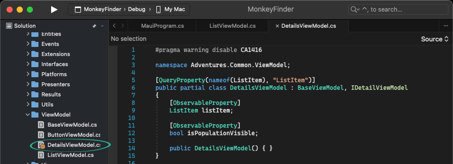
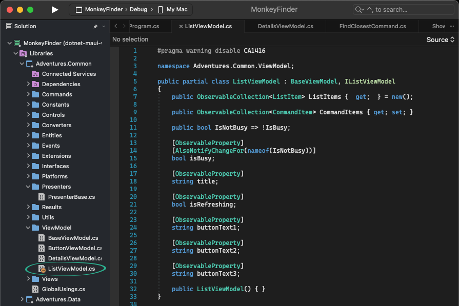
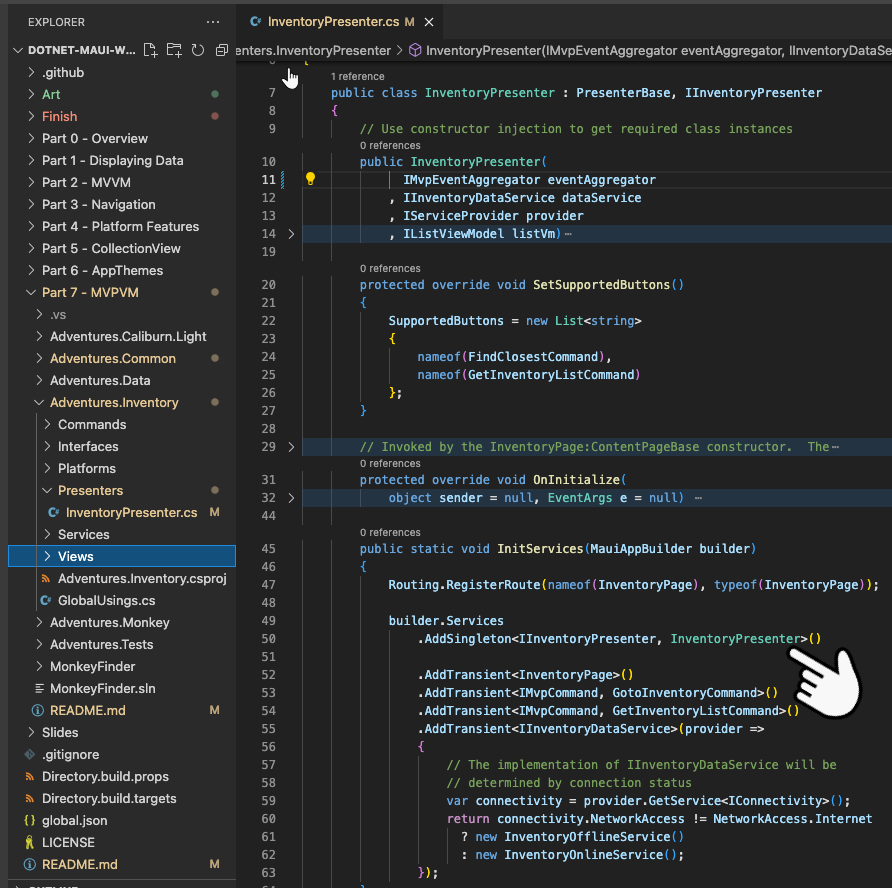
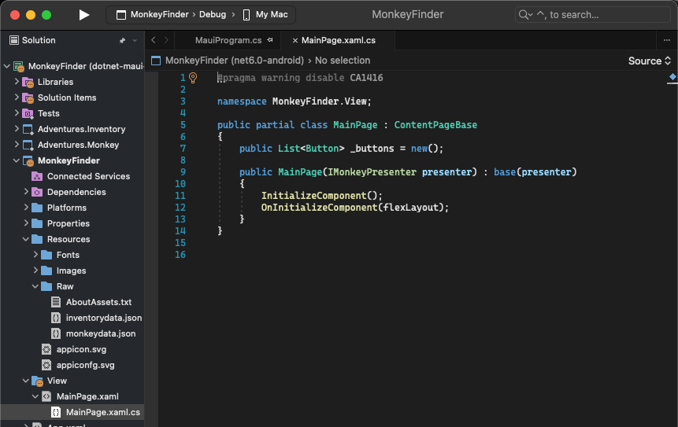
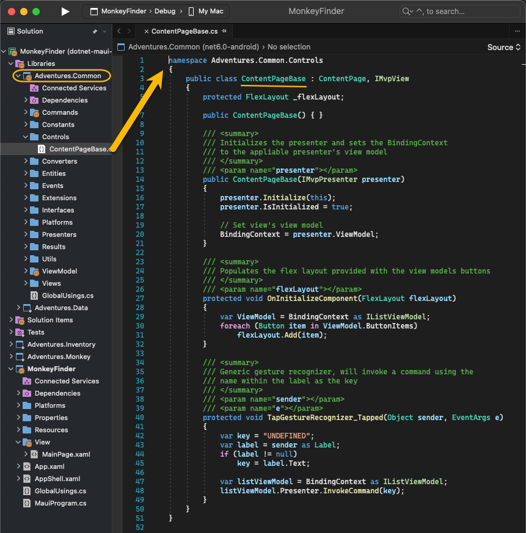
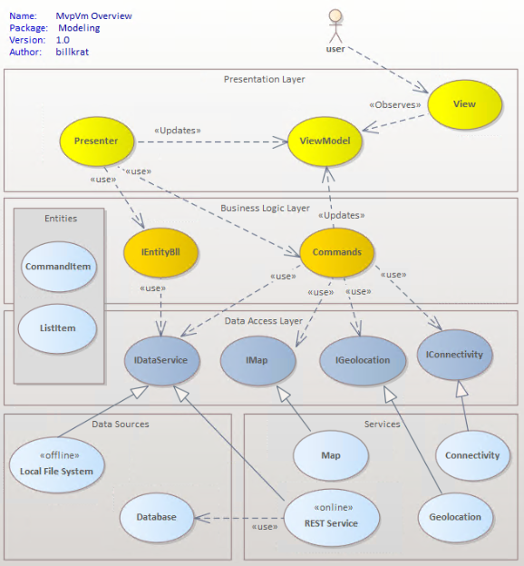

## Model View Presenter, ViewModel (MvpVm)

*Related blog:* [Decoupled Applications using MVP-VM](http://www.adventuresontheedge.net/post/2022/07/05/MAUI-MvpVm)

In Part 7 the framework is refactored to provide not only a Monkey finder, but also  a new furniture inventory feature.  In this fictional application both have similiar data structures, the only real difference is there is no "Population" for the inventory feature.

In a real-world MVVM application, adding new functionality [reusing existing view-models and views] could be problematic, particularly if they are in two separate projects that have no reference to each other.   In our case we have an `Adventures.Monkey` and `Adventures.Inventory` projects.  

MvpVm is an application framework pattern that not only [easily] allows reuse of view models, views, and other components, but also allows communication between projects.  We have our Monkey project subscribe to internet change events, when connectivity changes it publishes a notification that is handled by the Inventory project.  The Monkey project status (bottom left hand gray label) and Inventory status (bottom right hand switch) keep up with connectivity changes through this communication.

The refactored view models shown below should demonstrate how MvpVm is designed for reuse; since the presenter is responsible for populating the view-model, we can remove that logic out of the view-model so that it no longer tightly coupled to the Monkey finder logic.

For that matter, you'll find that the Monkey solution no longer holds any significant business logic.  The classes and functionality have been moved into `Adventures.Common`, `Adventures.Data`, `Adventures.Monkey`, and `Adventures.Inventory`.  The only real addition to the main solution is the inventorydata.json [offline data file].

Without knowledge of the MvpVm pattern, and inversion of control (IOC), it could be very confusing as to how this application works; decoupled frameworks require a basic knowledge of its practices and patterns.  

At 10k feet, the view will declare the presenter that will be used to manage it, the presenter in turn will declare the remaining components that will be used to support it.  The declarations come in the form of interfaces, implementation results from inversion of control; the framework will provide registered implementation for constructor interfaces.

Above we show how the MauiProgram declares all of the shared interfaces along with their implementation, e.g., IListViewModel uses the ListViewModel as its implementation.  It is in these registrations that the magic of IOC happens.  Note on line 56 above that the CreateMauiApp() is invoking InventoryPresenter.InitServices(builder).  This static method, shown below on line 45 allows us to encapsulate the Inventory registrations within the Presenter.  

Note on line 50 (pointed to below) how IInventoryPresenter is registered to InventoryPresenter as a singleton.  If a class constructor uses IInventoryPresenter within a constructor, an instance of InventoryPresenter will be provided by the framework.  If another class likewise has IInventoryPresenter within a constructor, it will receive the same instance as it is a singleton.  In contrast, IInventoryDataService (line 55 below) is a transient registration, this means a new instance will be constructed everytime it is encountered in an interface [or it is requested from the provider].  We use an IOC feature that allows us to use a function instead of a class type (provider => {...}).  For this registration every request for  IInventoryDataService will result in a new instance of `InventoryOfflineService` or `InventoryOnlineService` depending on the connectivity status. 

With this very basic understanding, this framework will now start to make more sense.

As you explore the MonkeyFinder solution you'll now see how significant the MainPage code-behind is.  In its constructor we see IMonkeyPresenter, thus when the invokes the MainPage it will provide an instance of the MonkeyPresenter, which in turn will provide an instance of all interfaces within its constructor.

When the Inventory button is clicked the InventoryPage will be navigated to instantiating it.  It will likewise have a presenter interface (IInventoryPresenter) in its constructor.  As with MainPage, it will invoke the `OnInitializeComponent(flexLayout)` in its constructor.

Note that the view's constructor invokes the base class constructor with a parameter of `presenter`, e.g.,`base(presenter)` on line 9 above.  This is where framework magic happens; the ContentPage constructor first invokes the `presenter.Initialize(this)` method and then sets the BindingContext to the view model the presenter declared.  This is how our pages, deriving from ContentPage [below] wires up our framework.

Once wired up, our decoupled application allows the different implementations of the interfaces it declared to handle processing.   You will not find code or business logic in any view model, it will be in the presenter and/or commands (IMvpCommand) that the app or presenter has declared.

