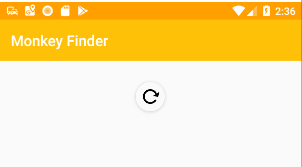
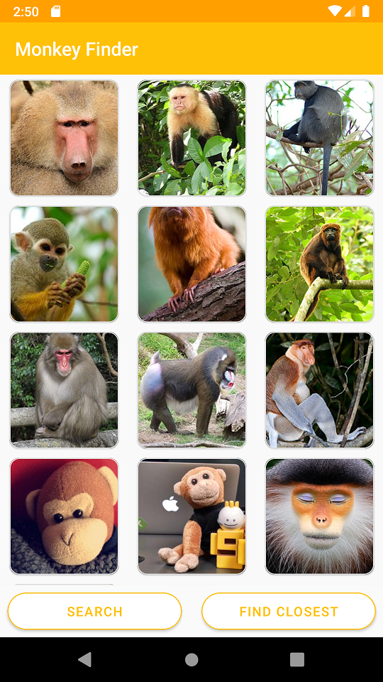
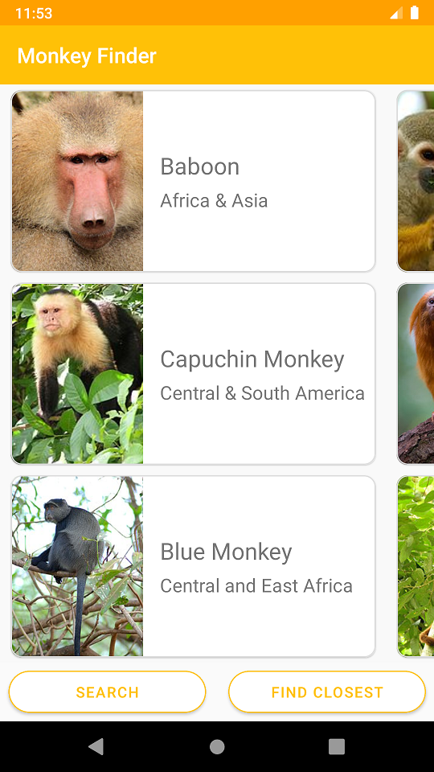

## Adding Pull-to-Refresh

This module is also available in [Chinese (Simplified)](README.zh-cn.md) & [Chinese (Traditional)](README.zh-tw.md).

The .NET MAUI `ListView` has built in support for pull-to-refresh, however a `RefreshView` enables developers to add pull-to-refresh to other controls such as `ScrollView` & `CollectionView`. 

Let's add the new `RefreshView` to add pull-to-refresh to our `CollectionView`.

Update the `CollectionView` logic by wrapping it with a `RefreshView` from:

```xml
<CollectionView
    Grid.ColumnSpan="2"
    ItemsSource="{Binding Monkeys}"
    SelectionMode="None">
    <!-- Template -->
</CollectionView>
```

to:

```xml
<RefreshView
    Grid.ColumnSpan="2"
    Command="{Binding GetMonkeysCommand}"
    IsRefreshing="{Binding IsRefreshing}">
    <ContentView>
        <CollectionView
            ItemsSource="{Binding Monkeys}"
            SelectionMode="None">
            <!-- Template -->
        </CollectionView>
    </ContentView>
</RefreshView>
```

Notice that we moved the `Grid.ColumnSpan="2"` to the `RefreshView` since it is the new parent view in the `Grid`.

Since the user can initiate a refresh, we will want to create a new variable in our code behind to bind to stop refreshing when we are done.

1. Open `MonkeysViewModel.cs` and add a new property:

    ```csharp
    [ObservableProperty]
    bool isRefreshing;
    ```

1. In the `finally` of the `GetMonkeysAsync` set `IsRefreshing` to `false`:

    ```csharp
    finally
    {
        IsBusy = false;
        IsRefreshing = false;
    }
    ```

This will enable pull-to-refresh on iOS, Android, macOS, and Windows (on touch screen):



> Important Note: If you are on iOS there currently is a bug which makes the UI look incorrect. It is recommended to remove the RefreshView when testing on iOS for the rest of the workshop.

## Layout

`CollectionView` will automatically layout items in a vertical stack layout. There are several built in `ItemsLayout` that can be used. Let's explore.

### LinearItemsLayout 

This is the default layout that can display items in either vertical or horizontal orientations. You can set the `ItemsLayout` property to `VerticalList` or `HorizontalList`. 

To access additional properties on the `LinearItemsLayout` we will need to set a sub-property:

```xml
<CollectionView
    ItemsSource="{Binding Monkeys}"
    SelectionMode="None">
    <!-- Add ItemsLayout -->
    <CollectionView.ItemsLayout>
        <LinearItemsLayout Orientation="Vertical" />
    </CollectionView.ItemsLayout>
    <!-- ItemTemplate -->
</CollectionView>
```

### GridItemsLayout

More interesting is the ability to use `GridItemsLayout` that automatically spaces out items with different spans.  

Let's use the `GridItemsLayout` and change the span to 3 

```xml
<CollectionView
    ItemsSource="{Binding Monkeys}"
    SelectionMode="None">
    <!-- Change ItemsLayout to GridItemsLayout-->
    <CollectionView.ItemsLayout>
        <GridItemsLayout Orientation="Vertical" Span="3" />
    </CollectionView.ItemsLayout>
    <!-- ItemTemplate -->
</CollectionView>
```



We can change the `Orientation` to `Horizontal` and now our CollectionView will scroll left to right!

```xml
<CollectionView.ItemsLayout>
    <GridItemsLayout Orientation="Horizontal" Span="5" />
</CollectionView.ItemsLayout>
```



Let's go back to our original single column `CollectionView`:

```xml
<CollectionView.ItemsLayout>
    <LinearItemsLayout Orientation="Vertical" />
</CollectionView.ItemsLayout>
```

## EmptyView

> Important Note: There is currently an issue on Android in which the EmptyView will not go away. It is recommended to remove it when testing on Android at this time.

There are many neat features to `CollectionView` including grouping, header, footers, and the ability to set a view that is displayed when there are no items.

Let's add an image centered in the `EmptyView`:

```xml
<CollectionView
    ItemsSource="{Binding Monkeys}"
    SelectionMode="None">
    <!-- Add EmptyView -->
    <CollectionView.EmptyView>
        <StackLayout Padding="100">
            <Image
                HorizontalOptions="Center"
                Source="nodata.png"
                HeightRequest="160"
                WidthRequest="160"
                VerticalOptions="Center" />
        </StackLayout>
    </CollectionView.EmptyView>
    <!-- ItemTemplate & ItemsLayout-->
</CollectionView>
```


In our next module, we'll learn about Application Themes.  Head over to [Part 6](../Part%206%20-%20AppThemes/README.md)
